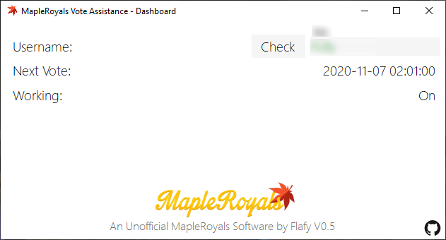

# MapleRoyals Vote Assistance (Unofficial)
This program automates the voting process for MapleRoyals as much as possible.  
The goal is to remove the daily pressure of memorizing to vote for MapleRoyals.

## Usage
Once you open the program a tray icon will be present in the taskbar. Clicking on it will open a window(image of it can be below).
Enter your username and press the "Check" button. If the username turns green. That means the program is now working with the username you've entered. Closing the window with the X button will not stop the program from running in the background.
To stop the program, right click the tray icon and press "Exit".

## How does it work
Whenever the program detects you can vote, it will open a window of chrome with a custom profile to remember cookies. The window will appear in the middle of the screen with the captcha waiting for you to complete it.

## Installation and Requirements
You must Have Chrome installed for the program to work.  
Go to the [Releases page](https://github.com/FlafyDev/MapleRoyals-Vote-Assistance/releases) and download the latest setup executable.
## Example Image

